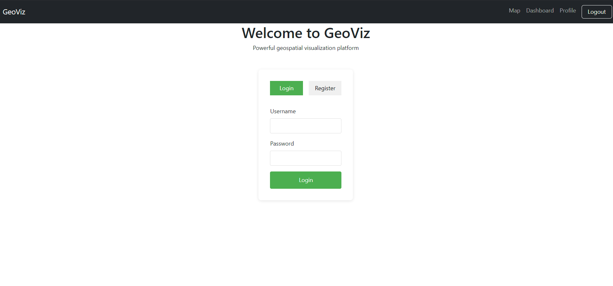
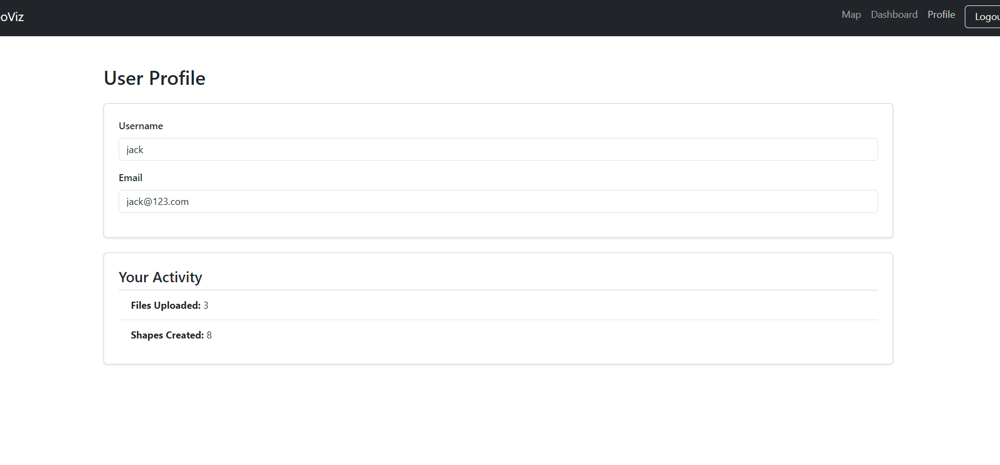
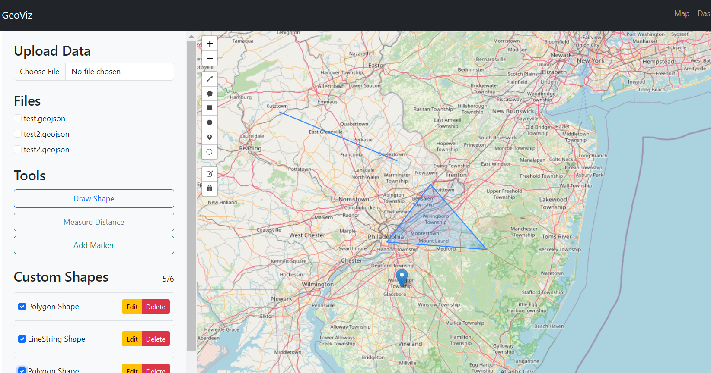
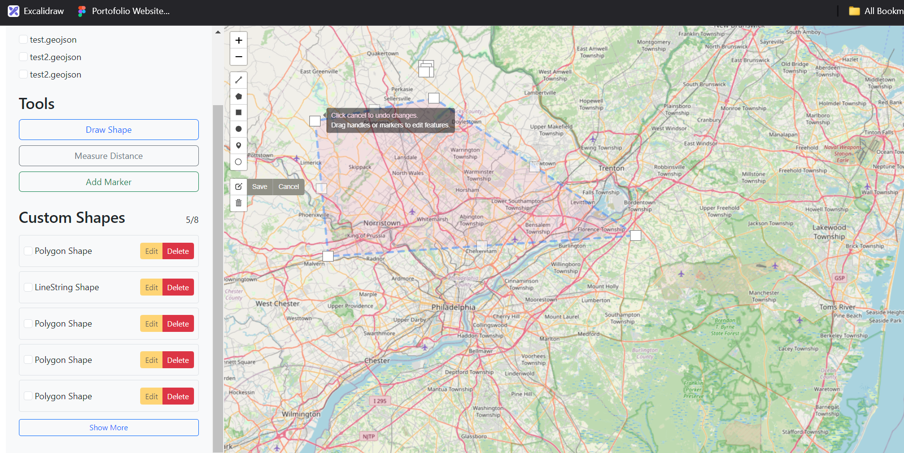

# Geo Data App

Geo Data App is a project that allows users to interact with geographical data through both a backend and frontend. 

## Getting Started

To run the project, you'll need to set up both the backend and frontend. Follow the steps below:

### Backend Setup

1. Navigate to the `backend` directory:
    ```bash
    cd backend
    ```

2. Install the necessary dependencies:
    ```bash
    npm install
    ```

3. Set up the environment variables by creating a `.env` file based on the `example.env` file provided.

4. Start the backend server:
    ```bash
    npm run start
    ```

The backend will be running at [http://localhost:5000](http://localhost:5000).

### Frontend Setup

1. Navigate to the `frontend` directory:
    ```bash
    cd frontend
    ```

2. Install the necessary dependencies:
    ```bash
    npm install
    ```

3. Start the frontend development server:
    ```bash
    npm run dev
    ```

The frontend will be running at [http://localhost:3000](http://localhost:3000).

## Notes

- Ensure that the backend is running before starting the frontend.
- Modify the environment variables in the `example.env` file to match your local setup.

Once both the backend and frontend are running, you can interact with the geo-data application in your browser.


## Screenshots

Here’s a preview of the UI:





